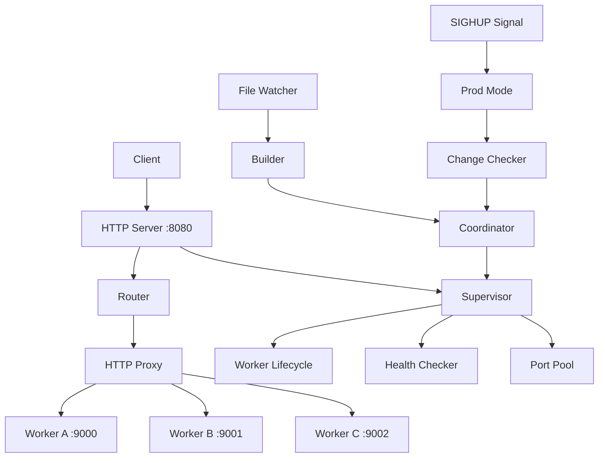

# TQServer Architecture

This document provides visual diagrams and explanations of TQServer's architecture.

## System Architecture

```
┌─────────────────────────────────────────────────────────────────┐
│                         TQServer System                         │
├─────────────────────────────────────────────────────────────────┤
│                                                                 │
│  ┌─────────────┐         ┌──────────────────────────────────┐ │
│  │   Client    │────────▶│      HTTP Server :8080           │ │
│  │  (Browser)  │◀────────│      (Main Server)               │ │
│  └─────────────┘         └──────────────────────────────────┘ │
│                                   │                            │
│                          ┌────────┴─────────┐                  │
│                          │                  │                  │
│                          ▼                  ▼                  │
│                  ┌──────────────┐   ┌──────────────┐          │
│                  │   Router     │   │  Supervisor  │          │
│                  │              │   │              │          │
│                  │ - Route      │   │ - Lifecycle  │          │
│                  │   Discovery  │   │ - Health     │          │
│                  │ - Request    │   │ - Ports      │          │
│                  │   Routing    │   │ - Cleanup    │          │
│                  └──────┬───────┘   └──────┬───────┘          │
│                         │                  │                  │
│                         │    ┌─────────────┘                  │
│                         │    │                                │
│                         ▼    ▼                                │
│                  ┌──────────────────┐                         │
│                  │   HTTP Proxy     │                         │
│                  │                  │                         │
│                  │ - Load Balance   │                         │
│                  │ - Health Check   │                         │
│                  │ - Zero Downtime  │                         │
│                  └──────┬───────────┘                         │
│                         │                                     │
│            ┌────────────┼────────────┐                        │
│            │            │            │                        │
│            ▼            ▼            ▼                        │
│    ┌─────────────┐ ┌─────────────┐ ┌─────────────┐          │
│    │  Worker A   │ │  Worker B   │ │  Worker C   │          │
│    │  :9000      │ │  :9001      │ │  :9002      │          │
│    │             │ │             │ │             │          │
│    │ - Handles   │ │ - Handles   │ │ - Handles   │          │
│    │   /route-a  │ │   /route-b  │ │   /route-c  │          │
│    └─────────────┘ └─────────────┘ └─────────────┘          │
│                                                               │
└───────────────────────────────────────────────────────────────┘
```

## Directory Structure

```
tqserver/
│
├── server/                   # Main server application
│   ├── src/                  # Server source code
│   │   ├── main.go          # Entry point
│   │   ├── config/          # Configuration
│   │   ├── proxy/           # HTTP reverse proxy
│   │   ├── router/          # Route discovery
│   │   └── supervisor/      # Worker lifecycle
│   │
│   ├── bin/                  # Compiled server binary
│   │   └── tqserver
│   │
│   ├── public/               # Public server assets
│   └── private/              # Private server files
│
├── workers/                  # All worker applications
│   └── {name}/              # Individual worker
│       ├── src/             # Worker source code
│       │   └── main.go
│       │
│       ├── bin/             # Compiled worker binary
│       │   └── tqworker_{name}
│       │
│       ├── public/          # Web assets (HTML, CSS, JS)
│       │   ├── index.html
│       │   └── styles.css
│       │
│       └── private/         # Private worker files
│           └── templates/   # Template files
│
├── pkg/                     # Shared packages
│   ├── supervisor/         # Timestamp, registry, health
│   ├── watcher/            # File watching
│   ├── builder/            # Build automation
│   ├── devmode/            # Dev mode controller
│   ├── prodmode/           # Prod mode controller
│   ├── modecontroller/     # Mode switching
│   └── coordinator/        # Reload coordination
│
├── scripts/                # Build & deployment
│   ├── build-dev.sh
│   ├── build-prod.sh
│   ├── deploy.sh
│   └── hooks/
│
└── config/                 # Configuration files
    ├── server.yaml
    └── deployment.yaml
```

## Development Mode Flow

```
┌──────────────────────────────────────────────────────────────────┐
│                      Development Mode                            │
└──────────────────────────────────────────────────────────────────┘

1. File Change Detected
   │
   │  Developer saves workers/index/src/main.go
   │
   ▼
┌─────────────────┐
│  File Watcher   │  (pkg/watcher)
│                 │
│ - fsnotify      │
│ - Debounce 50ms │
└────────┬────────┘
         │
         │ Change event
         │
         ▼
┌─────────────────┐
│    Builder      │  (pkg/builder)
│                 │
│ - go build      │
│ - Error handle  │
└────────┬────────┘
         │
         │ Build complete
         │
         ▼
┌─────────────────┐
│  Coordinator    │  (pkg/coordinator)
│                 │
│ - Stop old      │
│ - Start new     │
│ - Atomic switch │
└────────┬────────┘
         │
         │ Reload complete
         │
         ▼
┌─────────────────┐
│  HTTP Proxy     │
│                 │
│ - Route to new  │
│ - Zero downtime │
└─────────────────┘

Timeline: 300ms - 1000ms total
```

## Production Mode Flow

```
┌──────────────────────────────────────────────────────────────────┐
│                      Production Mode                             │
└──────────────────────────────────────────────────────────────────┘

1. Deployment
   │
   │  rsync binaries to server
   │
   ▼
┌─────────────────┐
│  deploy.sh      │
│                 │
│ - Sync binaries │
│ - Sync config   │
└────────┬────────┘
         │
         │ Send SIGHUP
         │
         ▼
┌─────────────────┐
│  Signal Handler │  (pkg/prodmode)
│                 │
│ - Receive HUP   │
│ - Trigger check │
└────────┬────────┘
         │
         │ Check timestamps
         │
         ▼
┌─────────────────┐
│ Change Checker  │  (pkg/supervisor)
│                 │
│ - Compare mtime │
│ - Detect change │
└────────┬────────┘
         │
         │ Changes found
         │
         ▼
┌─────────────────┐
│  Coordinator    │  (pkg/coordinator)
│                 │
│ - Build workers │
│ - Switch atomic │
└────────┬────────┘
         │
         │ Reload complete
         │
         ▼
┌─────────────────┐
│  Health Check   │  (pkg/supervisor)
│                 │
│ - Verify /health│
│ - Report status │
└─────────────────┘

Timeline: 500ms - 2000ms total
```

## Zero-Downtime Reload Process

```
Time    Old Worker (Port 9000)          New Worker (Port 9001)
─────   ────────────────────────        ────────────────────────

t0      Serving requests                Not started
        ├─ Request A → OK
        ├─ Request B → OK
        └─ Request C → OK

t1      Serving requests                Building...
        ├─ Request D → OK               (go build)
        └─ Request E → OK

t2      Serving requests                Starting...
        ├─ Request F → OK               (spawn process)
        └─ Request G → OK

t3      Serving requests                Health check...
        ├─ Request H → OK               (GET /health)
        └─ Request I → OK               └─ 200 OK

t4      Still serving                   Healthy!
        └─ Request J → OK               Ready to serve
                                        
        [ Atomic Switch ]               [ Atomic Switch ]
        
t5      Graceful shutdown               Now serving
        (finish in-flight)              ├─ Request K → OK
                                        ├─ Request L → OK
                                        └─ Request M → OK

t6      Stopped                         Serving requests
                                        └─ All requests → OK

Total downtime: 0ms (zero)
Switch time: ~100ms
```

## Port Management

```
┌─────────────────────────────────────────────────────────────┐
│                      Port Pool                              │
│                  (Range: 9000-9999)                         │
└─────────────────────────────────────────────────────────────┘

Initial State:
┌─────┬─────┬─────┬─────┬─────┬─────┬─────┐
│9000 │9001 │9002 │9003 │9004 │9005 │ ... │  Available Ports
└─────┴─────┴─────┴─────┴─────┴─────┴─────┘
  ▲
  │
  └─ Next available: 9000

After Starting Worker A:
┌─────┬─────┬─────┬─────┬─────┬─────┬─────┐
│█████│9001 │9002 │9003 │9004 │9005 │ ... │
└─────┴─────┴─────┴─────┴─────┴─────┴─────┘
  Used   ▲
         │
         └─ Next available: 9001

During Reload (Two Instances):
┌─────┬─────┬─────┬─────┬─────┬─────┬─────┐
│█████│█████│9002 │9003 │9004 │9005 │ ... │
└─────┴─────┴─────┴─────┴─────┴─────┴─────┘
  Old   New   ▲
              │
              └─ Next available: 9002

After Reload Complete:
┌─────┬─────┬─────┬─────┬─────┬─────┬─────┐
│9000 │█████│9002 │9003 │9004 │9005 │ ... │
└─────┴─────┴─────┴─────┴─────┴─────┴─────┘
         New
  (Port 9000 released and recycled)
```

## Worker Lifecycle States

```
┌───────────┐
│  STOPPED  │  Initial state
└─────┬─────┘
      │
      │ Start command
      ▼
┌───────────┐
│ STARTING  │  Process spawning
└─────┬─────┘
      │
      │ Process running
      ▼
┌───────────┐
│  RUNNING  │◀──┐ Health check passing
└─────┬─────┘   │
      │         │
      │ Health  │
      │ check   │
      ▼         │
┌───────────┐   │
│  HEALTHY  │───┘ Steady state
└─────┬─────┘
      │
      ├─── Reload signal ────┐
      │                      │
      │                      ▼
      │               ┌────────────┐
      │               │  BUILDING  │  New version
      │               └──────┬─────┘
      │                      │
      │                      ▼
      │               ┌────────────┐
      │               │  STARTING  │  New instance
      │               └──────┬─────┘
      │                      │
      ▼                      ▼
┌───────────┐         ┌────────────┐
│ DRAINING  │         │  HEALTHY   │  Switch!
└─────┬─────┘         └────────────┘
      │
      │ In-flight complete
      ▼
┌───────────┐
│  STOPPED  │  Old instance terminated
└───────────┘
```

## Health Check Flow

```
┌────────────────────────────────────────────────────────────┐
│               Health Check System                          │
└────────────────────────────────────────────────────────────┘

Every 10 seconds:

Health Checker
      │
      ├─────────────────┬─────────────────┬───────────────
      │                 │                 │
      ▼                 ▼                 ▼
┌──────────┐      ┌──────────┐      ┌──────────┐
│ Worker A │      │ Worker B │      │ Worker C │
│  :9000   │      │  :9001   │      │  :9002   │
└────┬─────┘      └────┬─────┘      └────┬─────┘
     │                 │                 │
     │ GET /health     │ GET /health     │ GET /health
     │                 │                 │
     ▼                 ▼                 ▼
   200 OK            200 OK            500 Error
  "healthy"         "healthy"         "unhealthy"
     │                 │                 │
     └─────────────────┴─────────────────┘
                       │
                       ▼
              ┌────────────────┐
              │  Aggregated    │
              │  Status        │
              │                │
              │  A: healthy    │
              │  B: healthy    │
              │  C: unhealthy  │
              └────────────────┘
                       │
                       ▼
              Public endpoint:
              GET /health
              └─ Overall: degraded
```

## Request Flow

```
Client Request: GET /api/users
        │
        ▼
┌───────────────────┐
│  Main Server      │
│  :8080            │
└────────┬──────────┘
         │
         │ Route lookup
         ▼
┌───────────────────┐
│  Router           │
│                   │
│  /api → Worker B  │
└────────┬──────────┘
         │
         │ Proxy request
         ▼
┌───────────────────┐
│  HTTP Proxy       │
│                   │
│  Target: :9001    │
└────────┬──────────┘
         │
         │ Forward
         ▼
┌───────────────────┐
│  Worker B         │
│  :9001            │
│                   │
│  Handle /api/users│
└────────┬──────────┘
         │
         │ Response
         ▼
┌───────────────────┐
│  HTTP Proxy       │
│  (copy response)  │
└────────┬──────────┘
         │
         │ Return
         ▼
┌───────────────────┐
│  Client           │
│  (receives data)  │
└───────────────────┘
```

## Deployment Architecture

```
┌────────────────────────────────────────────────────────────┐
│                   Development Machine                      │
│                                                            │
│  ┌──────────────┐        ┌──────────────┐                │
│  │  Source Code │───────▶│  build-prod  │                │
│  │  Changes     │        │              │                │
│  └──────────────┘        └──────┬───────┘                │
│                                  │                        │
│                                  │ Binaries               │
│                                  ▼                        │
│                          ┌──────────────┐                │
│                          │  deploy.sh   │                │
│                          │              │                │
│                          │  rsync →     │                │
│                          └──────┬───────┘                │
└─────────────────────────────────┼────────────────────────┘
                                  │
                                  │ SSH + rsync
                                  │
┌─────────────────────────────────┼────────────────────────┐
│                   Production Server                       │
│                                  │                        │
│                                  ▼                        │
│                          ┌──────────────┐                │
│                          │  New Binaries│                │
│                          │  Deployed    │                │
│                          └──────┬───────┘                │
│                                 │                        │
│                                 │ SIGHUP signal          │
│                                 ▼                        │
│                          ┌──────────────┐                │
│                          │  TQServer    │                │
│                          │  Running     │                │
│                          │              │                │
│                          │  Detects     │                │
│                          │  Changes     │                │
│                          │              │                │
│                          │  Reloads     │                │
│                          │  Workers     │                │
│                          └──────────────┘                │
│                                                           │
└───────────────────────────────────────────────────────────┘
```

## Component Interactions



This architecture provides:
- **Zero-downtime deployments**: Atomic worker switching
- **Fast development**: Sub-second hot reloads
- **Process isolation**: Each route in separate process
- **Health monitoring**: Continuous worker health checks
- **Efficient ports**: Port pool prevents exhaustion
- **Flexible deployment**: Dev and prod modes
